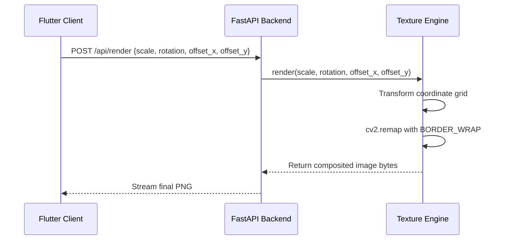

# Vastra AI Implementation Plan - Customizable Fabric Placement

This document details the design specifications and steps taken to implement pattern scaling, rotation, and translation offsets for fabric visualization.

---

## 1. Architectural Changes Overview

To allow real-time pattern adjustments on the final composited image, we updated the FastAPI server and the Flutter frontend app.



---

## 2. Detailed Implementation Steps

### Phase 1: Backend API & Model Updates

#### 1. API Route & Request Validation (`main.py`)
- Updated the Pydantic request model `RenderRequest` to accept four optional parameters with default values:
  - `tile_scale` (float, default `1.0`): Multiplies the base tile size.
  - `rotation` (float, default `0.0`): Controls rotation angle in degrees.
  - `offset_x` (float, default `0.0`): Translates the pattern horizontally.
  - `offset_y` (float, default `0.0`): Translates the pattern vertically.
- Forwarded these parameters from the `/api/render` POST route to `engine.render()`.

#### 2. Rendering Engine Pipeline (`pipeline.py`)
- Modified the signature of `TextureProjectionEngine.render()` to accept `tile_scale`, `rotation`, `offset_x`, and `offset_y`.
- Rewrote the internal `_tile_texture()` helper:
  - Computed base tile dimensions.
  - Created coordinate matrices (`grid_x`, `grid_y`) corresponding to the ROI.
  - Shifted coordinates to center them, allowing rotation around the center of the target area.
  - Derived target mapping points using a standard 2D rotation matrix:
    $$x_{\text{map}} = (dx \cdot \cos\theta + dy \cdot \sin\theta) \cdot s_x + t_x$$
    $$y_{\text{map}} = (-dx \cdot \sin\theta + dy \cdot \cos\theta) \cdot s_y + t_y$$
  - Used OpenCV `cv2.remap` with `borderMode=cv2.BORDER_WRAP` to warp coordinates and repeat the pattern seamlessly.

---

### Phase 2: Frontend Client & State Management

#### 1. Backend Service Interface (`api_service.dart`)
- Updated `renderFinalFabric()` to accept the positioning variables:
  ```dart
  Future<Uint8List> renderFinalFabric({
    required String sessionId,
    required String fabricTextureId,
    required String productCategory,
    String? fabricImageBase64,
    bool refineWithDiffusion = false,
    double tileScale = 1.0,
    double rotation = 0.0,
    double offsetX = 0.0,
    double offsetY = 0.0,
  })
  ```
- Appended these inputs to the JSON payload map.

#### 2. State Controller (`vastra_provider.dart`)
- Added placement state variables: `_tileScale`, `_rotation`, `_offsetX`, `_offsetY`.
- Implemented state parameters `_lastFabricTextureId` and `_lastCustomFabricBytes` to remember the active design context when triggering re-renders from sliders.
- Added getters, setters, and a `resetPlacement()` routine invoked during workspace initialization or fabric swaps.

---

### Phase 3: Result screen Controls

#### 1. Interactive Slider Panel (`result_screen.dart`)
- Added a secondary **Adjust** button next to **Save to Gallery** in `_buildActionButtons()`.
- Implemented `_FabricAdjustmentPanel` - a modal bottom sheet incorporating four sliders and a **Reset** button:
  - **Pattern Scale**: `0.2` to `3.0` (default `1.0`).
  - **Rotation Angle**: `-180.0` to `180.0` (default `0.0`).
  - **Position X/Y Shift**: `-1.0` to `1.0` (default `0.0`).
- Configured sliders with `onChangedEnd` to fire update requests to the backend only when the user finishes dragging, minimizing unnecessary API requests.
- Integrated a loading indicator stack in the result view.

---

## 3. Verification Plan

### 1. Verification Scripts
Run the custom test scripts in the `scratch/` directory to generate baseline vs. transformed output pairs:
```bash
python scratch/test_full_pipeline.py
python scratch/test_new_pipeline.py
```

### 2. Static Analysis
Run Flutter static analysis on the frontend project:
```bash
flutter analyze
```

### 3. Interactive Runtime Checks
Launch the development server and run the app:
1. Tap an object (e.g. bed) on the room image and complete basic segmentation.
2. Select a floral fabric and click **Visualize**.
3. Confirm the image is rendered with realistic lighting and no mirrored center lines.
4. Click **Adjust**, move the **Scale** slider to `1.5` and **Rotation** to `-15°`, and verify that the layout adapts instantly to match the depth and direction of the bed.
