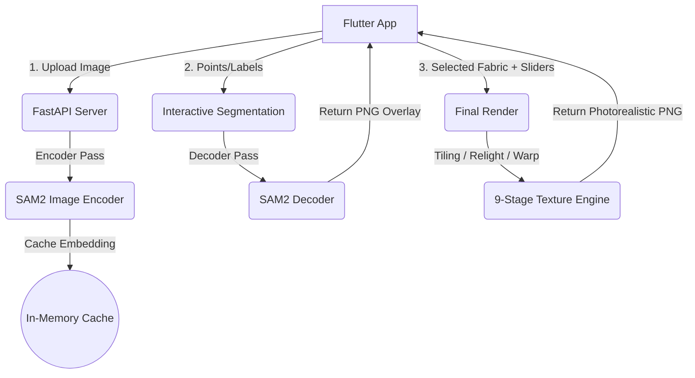
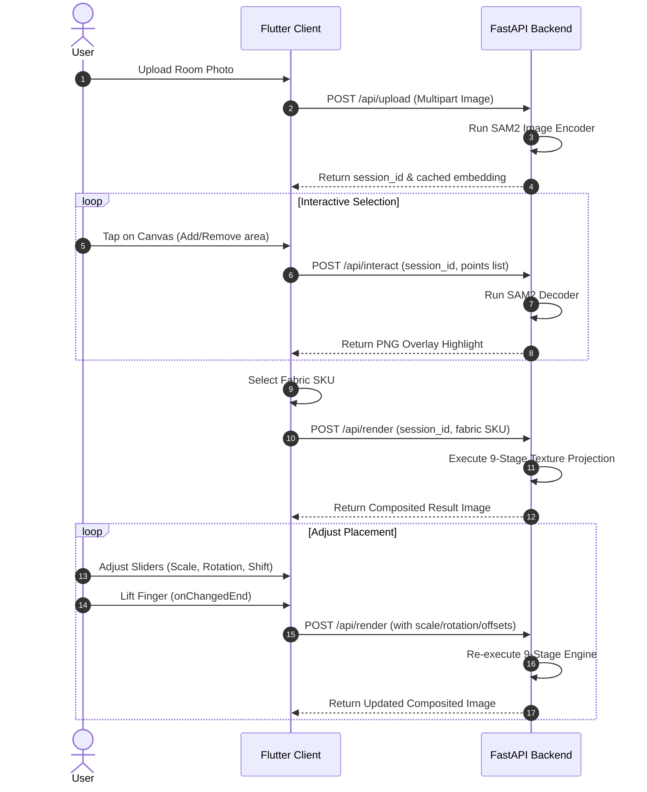

# Vastra AI Architecture & Project Guide

Vastra is an AI-powered interior design and fabric visualization application. It allows users to upload a photograph of a room, select a target fabric object (e.g., bedsheet, curtain, sofa cover, rug) using interactive tap prompts, and visualize alternative fabric patterns seamlessly projected on the object in photorealistic quality.

---

## 1. System Architecture Overview

Vastra employs a **decoupled client-server architecture**:
* **Frontend**: A high-performance Flutter mobile/desktop app. It manages local paint strokes, coordinates taps, stores session states, and displays live image previews with custom glassmorphic UI controls.
* **Backend**: A FastAPI server that hosts PyTorch-based AI engines and a classical 9-stage photorealistic texture projection pipeline.

---

## 2. Artificial Intelligence Models

### A. SAM2 (Segment Anything Model 2)
For interactive, point-guided object segmentation, the backend uses the **SAM 2 (Hiera-Tiny)** architecture. It operates in a decoupled way:
1. **Encoder Pass (`predict_encoder`)**: When a room image is uploaded, it runs once through the heavy SAM2 Image Encoder. This generates feature embeddings which are cached in memory (with a 10-minute TTL).
2. **Decoder Pass (`predict_decoder`)**: When a user taps the canvas, the lightweight decoder runs using the cached embeddings, positive taps (target zone), and negative taps (refinement). This pass executes in **10–50ms**, returning real-time binary segmentation masks.

### B. Diffusion Inpainting (Optional Hybrid Refinement)
To go beyond classical texture warping, the user can toggle **AI Diffusion Refinement**.
- When enabled, the classically composited render is passed into a secondary diffusion inpainting service.
- Using a low strength (`strength=0.02`) and a prompt (e.g., `"photorealistic bedsheets, matching fabric pattern, high quality folds and wrinkles"`), the model refines the edges, shadows, and fabric geometry to blend perfectly with the environment.

---

## 3. Classical Texture Projection Pipeline

To project a 2D fabric swatch onto a 3D surface while keeping the fabric pattern sharp, clear, and perfectly lit, Vastra runs a **9-Stage Classical Rendering Engine**:

### Stage 1: Coordinate-Based Remap Tiling
Instead of checkerboard mirroring (which duplicates and flips patterns, ruining text/orientations), the engine uses a coordinate grid mapping:
$$\begin{pmatrix} x' \\ y' \end{pmatrix} = \begin{pmatrix} \cos\theta & \sin\theta \\ -\sin\theta & \cos\theta \end{pmatrix} \begin{pmatrix} x - x_c \\ y - y_c \end{pmatrix} \cdot \frac{1}{\text{scale}} + \begin{pmatrix} \text{offset}_x \\ \text{offset}_y \end{pmatrix}$$
Using `cv2.remap` with `BORDER_WRAP`, the texture wraps continuously, supporting real-time scaling, rotation, and translation offsets.

### Stage 2: Perspective Warp
Flat surfaces (`bedsheets`, `carpets`, `rugs`) undergo row-wise horizontal compression:
- Upper rows of the ROI are compressed horizontally to simulate depth receding into the background.

### Stage 3: Shading Map Extraction
The original scene's illumination must modulate the new fabric. A dual Gaussian blur is used:
- **Macro Shading** (very large blur, e.g., 14% of bbox width) removes all original fabric pattern detail, leaving only room-wide shadow gradients.
- **Meso Shading** (medium blur) extracts fold contours.
- Combined, they prevent the original fabric pattern from bleeding through into the new design.

### Stage 4: Specular Highlight Recovery
The engine isolates bright specular sheen spots from the original fabric (pixels brighter than $\text{mean} + 1.5 \times \text{std}$) and overlays them onto the warped fabric to restore natural light reflections.

### Stage 5: Ambient Occlusion (AO)
Darkens localized fold valleys by calculating local lighting deviations:
$$\text{AO} = 1.0 - \frac{\text{Local Mean}}{\text{Global Mean}}$$

### Stage 6: Fold-Following Warp
To physically deform the pattern along folds:
- High-frequency scene wrinkles are extracted using Sobel gradients.
- This displacement field geometrically bends the fabric coordinate grid (clamped to $\pm 8\text{px}$ to avoid pixel tearing).

### Stage 7: LAB Channel Relighting
- The fabric is converted from RGB to CIELAB color space.
- The **L (Luminance)** channel is modulated by the extracted Shading, Ambient Occlusion, and Specular maps.
- The **A and B (Chrominance)** channels are shifted slightly based on the average color temperature of the room outside the mask, blending the fabric into the room's white balance.

### Stage 8: Detail Sharpening
An unsharp masking filter is applied to the composited fabric ROI to maximize fabric print definition.

### Stage 9: Thin-Edge Composite
A 5px Gaussian alpha feather is applied exclusively to the mask boundary, blending the edges into the background without color bleeding.

---

## 4. Technology Stack & Libraries

### Backend (Python)
* **FastAPI & Uvicorn**: Lightweight web framework and ASGI server for hosting endpoints.
* **PyTorch & Torchvision**: Powers the deep learning models (SAM2).
* **OpenCV (opencv-python)**: Handles high-performance matrix transforms, coordinate remapping, Gaussian blurs, and Sobel gradients.
* **NumPy**: Facilitates multi-dimensional array operations.
* **Pillow (PIL)**: Supports loading, saving, and color-space conversions for various image formats.
* **Pydantic**: Handles data validation for inbound API request payloads.

### Frontend (Flutter/Dart)
* **Flutter Framework**: Powers the cross-platform mobile, desktop, and web user interface.
* **Provider**: Manages app state, upload sessions, and rendering parameters.
* **Http**: Handles file uploads, interactive point messaging, and final render queries.
* **Flutter Animate**: Facilitates smooth, luxury animations (e.g., gold pulse loops).

---

## 5. Main Application Flow

